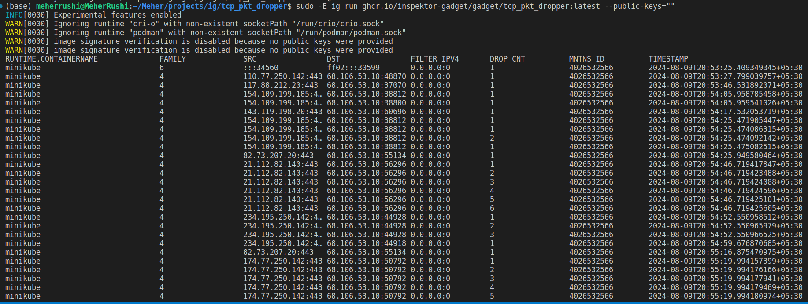

# egress tcp drop

Drop egress TCP packets based on destination address and port pair

## How to use

- Clone the repositoty and change directory inside the project
```bash
$ git clone https://github.com/MeherRushi/egress_tcp_drop_gadget.git
$ cd egress_tcp_drop_gadget/
```

- Build the image after setting the experimental tag
```bash
$ export IG_EXPERIMENTAL=true
$ sudo -E ig image build -t tcp_pkt_dropper .
```

- Run the image
```bash
$ sudo -E ig run ghcr.io/inspektor-gadget/gadget/tcp_pkt_dropper:latest --public-keys=""
```

## Flags

#### `--a`
- **Description:** The first 8 bits of the filter IPv4 address in Integer Format (e.g., 127)
- **Default value:** `0`

#### `--b`
- **Description:** The second 8 bits of the filter IPv4 address in Integer Format (e.g., 0)
- **Default value:** `0`

#### `--c`
- **Description:** The third 8 bits of the filter IPv4 address in Integer Format (e.g., 0)
- **Default value:** `0`

#### `--d`
- **Description:** The last 8 bits of the filter IPv4 address in Integer Format (e.g., 1)
- **Default value:** `0`

#### `--p`
- **Description:** Port number (e.g., 443)
- **Default value:** `0`

#### `--iface`
- **Description:** Network interface to attach to
- **Default value:** `""`


### Example Command :
```bash
sudo -E irun ghcr.io/inspektor-gadget/gadget/tcp_pkt_dropper:latest --public-keys="" --a 110 --b 77 --c 250 --d 142 --p 443
```

- This will filter and drop the TCP packets with destination address, port pair `110.77.142:443`


## Screenshot



## Requirements

- ig v0.26.0 (CHANGEME)
- Linux v5.15 (CHANGEME)

## License (CHANGEME)

The user space components are licensed under the [Apache License, Version
2.0](LICENSE). The BPF code templates are licensed under the [General Public
License, Version 2.0, with the Linux-syscall-note](LICENSE-bpf.txt).